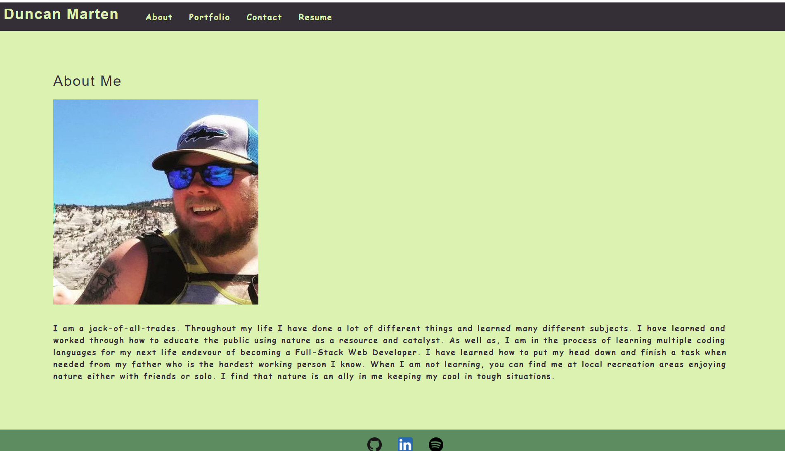

  # React Portfolio
  

  
  
  ## Description
  This application is a representation of what I have learned in the bootcamp course I took as well as ways to see what I know and how to contact me.  In the application you can see projects that I have done, skills I have, and my Resume.  There also is my GitHub, LinkedIn and Spotify profiles linked.

  ## Table of Contents
  * [Usage](#usage)
  * [License](#license)
  * [Contributing](#contributing)
  * [Questions](#questions)

  ## Usage
  To use just view the web application at https://duncanmarten.github.io/react-portfolio/.

  ## License
  [MIT](https://opensource.org/licenses/MIT)

  ## Contributing
  This is just for viewing and contacting me for prospective employment oppurtunities.

  ## Questions
  * Contact me on [Github](http://www.github.com/DuncanMarten)
  * Contact me by [email](mailto:duncanmarten@yahoo.com?subject=[Question]%20About%20React Portfolio)
  